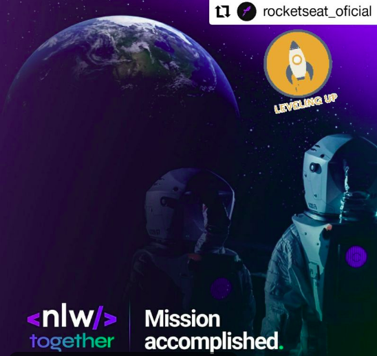

[node-url]: https://nodejs.org/en
[yarn-url]: https://classic.yarnpkg.com/
[npm-url]:  https://www.npmjs.com/

<p align="center">
   
</p>

<p align="center">	

 

  
  
  <a href="https://github.com/william-ribeiro/nlw-together-nodejs/commits/master">  
  
  
  
  </a> 

  
 
  <a href="https://github.com/william-ribeiro/nlw-together-nodejs/stargazers">
    
  </a>
     <a href="https://www.linkedin.com/in/william-ribeiro-0b5ab911a/">
      
   </a>

</p>

> :rocket: Project developed on Next Level Together @Rocketseat

# :computer: Technologies
This project was made using the follow technologies:

* [Typescript](https://www.typescriptlang.org/)           
* [Express](https://expressjs.com/)      

# :rocket: Features

* App that lets you send compliments to employees

# Starting day one

This project will be built and updated step by step

### Getting Started 🚀

#### Cloning

```ps
# Clone the repository using git
$ git clone https://github.com/william-ribeiro/nlw-together-nodejs.git

# Access the project folder
$ cd nlw-together-nodejs
```

#### Requirements
* [Node.js][node-url]
* [Yarn][yarn-url] or [npm][npm-url]

This project use third party dependencies that need to be installed, use that command to install all needed dependencies

# Server
Install all needed dependencies
```ps
$ yarn install
```

To start the Server run the command
```ps
$ yarn dev
```

# :closed_book: License

Released in 2021 :closed_book: License

Made with love by [William Ribeiro](https://github.com/william-ribeiro) 🚀.
This project is under the [MIT license](./LICENSE).


